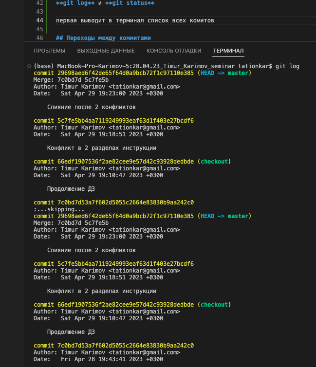
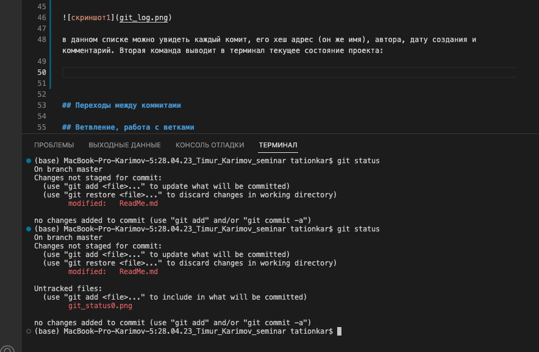
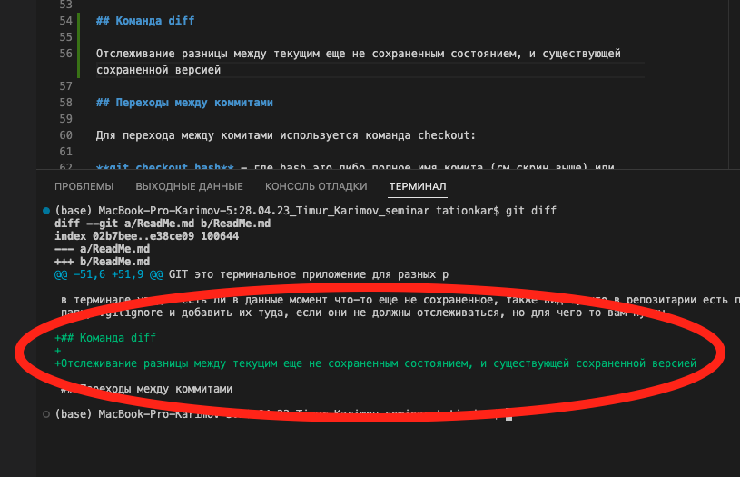
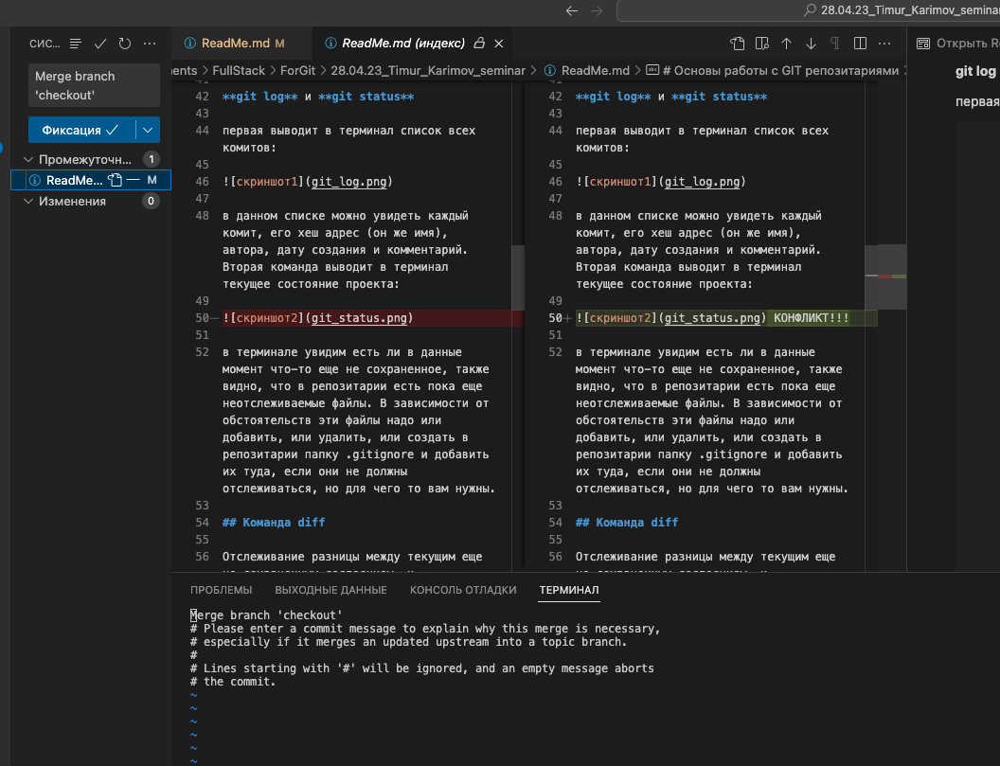

# Основы работы с GIT репозитариями

GIT это терминальное приложение для разных разработчиков, оно нужно для версионирования и совместной работы с другими людьми.
Перед началом работы с GIT его нужно установить на ваш компьютер. Информация есть в интернет.

## Инициализация и авторизация

Перед началом работы необходимо создать папку для проекта и инициализировать в ней, с помощью терминала GIT, набрав в терминале 

**git init** 

Для первого раза необходимо представится, ввести свое имя и пароль. Для этого необходимо ввести сначала комманду 

**git config --global user.name ''ваше имя''** 

а потом 

**git config --global user.email ''ваша почта''** 

В дальнейшем на том же компьютере это делать не обязательно, если конечно он только ваш.

## Добавление документов в репозирарий

После создания документа в инициализированном репозитарии необходимо начинать его отслеживать - его изменения и, возможно варианты редактирования. Для добавления воспользуетесь командой 

**git add ''name.type''** или **git add .** 

в первом случае добавится только один файл, причем надо обязательно указать тип файла, во втором добавится все, что есть в репозитарии.

## Команда commit 

После сохранения и добавления документа, надо зафиксировать его изменения, которое вы сами считаете завершенным на данном этапе, для этого надо набрать

**git commit -m ''Ваше сообщение к комиту''**

сообщение (комментарий) писать надо обязательно, для того, что в дальнейшей работе вы всегда знали, что именно сделали в данном сохранении.

## Команды log и status

Информационные команды

**git log** и **git status**

первая выводит в терминал список всех комитов:

в данном списке можно увидеть каждый комит, его хеш адрес (он же имя), автора, дату создания и комментарий. Вторая команда выводит в терминал текущее состояние проекта:

в терминале увидим есть ли в данные момент что-то еще не сохраненное, также видно, что в репозитарии есть пока еще неотслеживаемые файлы. В зависимости от обстоятельств эти файлы надо или добавить, или удалить, или создать в репозитарии папку .gitignore и добавить их туда, если они не должны отслеживаться, но для чего то вам нужны.

## Команда diff

Отслеживание разницы между текущим еще не сохраненным состоянием, и существующей сохраненной версией - **git diff**

## Переходы между коммитами

Для перехода между комитами используется команда checkout:

**git checkout hash** - где hash это либо полное имя комита (см скрин команды **git log** выше) или достаточно начала "имени" в 5-6 символов, git сам найдет полное имя и переключит состояние на нужный комит

## Ветвление, работа с ветками

При помощи веток в VCS можно:

* Реализовать фичу, не мешая остальным.

* Проводить модерацию (кодревью) нового кода перед непосредственным добавлением в кодовую базу.

* Отвлечься от реализации фичи и починить баг в другом месте.
* Вовсе отложить начатую фичу до лучших времен.
* Получить запрос на доработку старой версии программы от заказчика и поддерживать далее несколько версий ПО.
* Поэкспериментировать с кодом без страха сломать билд.
* Организовать процесс поэтапного выпуска программы (разработка - тестирование - релиз), не блокируя разработку следующей версии.
* Организовать работу с open source сообществом или подрядчиком.
* Запилить постоянную автоматическую сборку с рабочей ветки с прогоном тестов и ручную авторизованную сборку релиза с релиз-ветки.

[Источник](https://ru.stackoverflow.com/questions/359844/Зачем-нужны-ветки)

Команды для работы с ветками:

**git branch** - показывает список веток с отмечанием текущей

**git branch new_branch** - создание новой ветки

**git checkout new_branch** - переход на новую(другую) ветку

**git merge new_branch** - слияние текущей ветки с веткой new_branch

**git branch -d new_branch** - удаление ненужной более ветки new_branch

